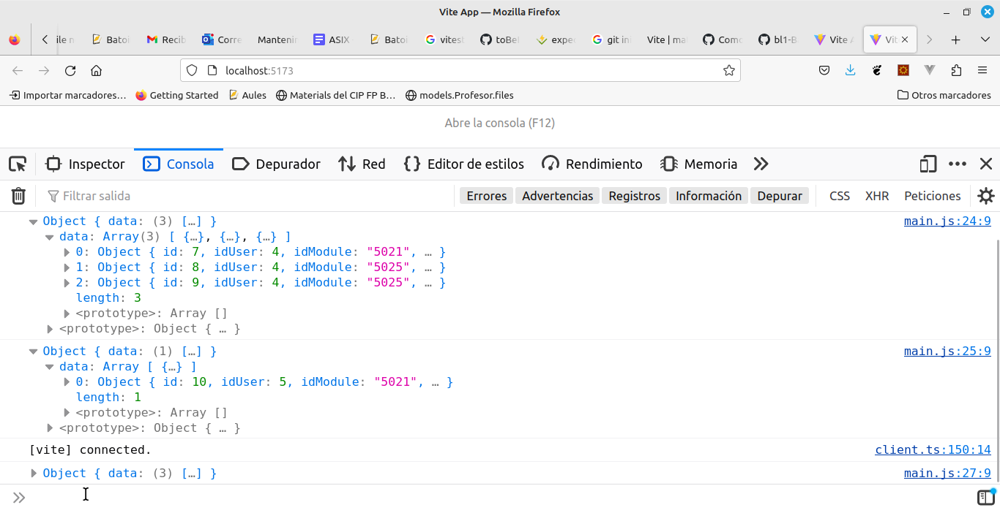

# Bloc 1: Javascript. UT 3: Clases
## Práctica 3.1 - Clases en BatoiBooks
Continuando con nuestra aplicación para vender libros de texto y apuntes vamos a construir las clases que usaremos en la aplicación. Recordad que los datos con los que trabaja la aplicación los tenemos en el fichero `datos.js` en una variable llamada `data`.

Como empezamos a tener muchos ficheros Javascript crearemos un directorio al que llamaremos `/src` para meterlos todos (excepto `main.js` que al ser nuestro fichero principal lo dejaremos en el raíz del proyecto). Dentro de _/src_ crearemos una carpeta llamada `model` donde guardaremos las clases. Aunque podríamos hacerlas ya todas, al menos vamos a hacer aquellas con las que estamos trabajando: _book, books, user, users, module_ y _modules_. 

Las clases de objeto (_Book_, _User_ y _Module_) tendrán
- constructor: recibe cada campo del objeto a crear (excepto en _Book_ que al ser muchos campos le pasareos un objeto con todos ellos)
- método `toString` para mostrar el objeto

Las clases de array (_Books_, _Users_ y _Modules_) tendrán:
- constructor: inicializa una propiedad llamada _data_ a un array vacío
- `populateData`: recibe un array con los datos iniciales y los carga en las clases. No devuelve nada
- `addItem`: recibe un objeto con los datos del nuevo elemento (sin _id_) y lo añade al array. Devuelve el nuevo elemento añadido
- `removeItem`: recibe una _id_ (o un _code_ si es un módulo) y lo elimina del array. Si no existe lanzará una excepción
- `getItemById/getItemByCode`: recibe una _id_ (o un _code_ si es un módulo) y devuelve el elemento con dicha _id_ o un objeto vacío si no existe (para _users_ y _modules_ ya los tenemos hechos)
- `toString` muestra los elementos del array (llama al `toString` de cada elemento)
- el resto de métodos hechos en el ejercicio anterior (`booksFromUser`, `getUserByNick`, etc). Para poder aplicar varios métodos de filtrado a los libros (p.ej. filtrar por módulo y precio) modificaremos los métodos que filtran libros para que no devuelvan un array de libros sino un nuevo objeto _Books_ con los libros filtrados (al que podremos aplicar un nuevo filtro). Ej.:
  ```javascript
  booksFromUser(userId) {
    const filteredBooks = new Books()
    filteredBooks.data = this.data.filter((item) => item.idUser === userId)
    return filteredBooks
  }
  ```

Al final de cada fichero de clase exportaremos la misma para poderla usar donde la necesitemos. En `book.class.js` será:
```javascript
export default class Book {
  ...
}
```

Y donde tengamos que usarla la importaremos, por ejemplo en `books.class.js`:
```javascript
import Book from './book.class'
```

En el `main.js` lo que haremos es:
- importamos la variable _data_ del fichero `datos.js` (ya lo tenéis hecho)
- llenamos las clases _users_, _modules_ y _books_ con sus datos (_populateData_)
- mostramos por consola: 
  - todos los libros del módulo 5021 que están en buen estado ("good")
  - incrementa un 10% el precio de los libros del módulo 5025 y muéstralos

El resultado debe ser similar al de la práctica anterior sólo que en vez de mostrar Arrays mostrará Objetos Books:



**MUY IMPORTANTE**: pasa los tests para asegurarte aprobar este ejercicio.
