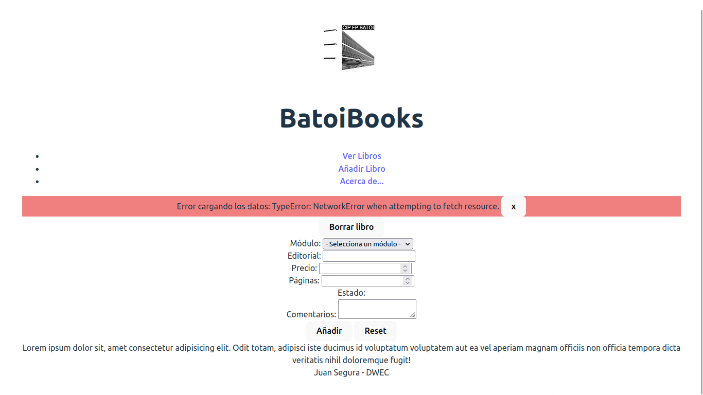

# Bloc 1: Javascript. UT 5: DOM
## Práctica 5.1 - Página principal de BatoiBooks
Ahora vamos a empezar a hacer la parte visual de nuestra aplicación.

La estructura visual de nuestra aplicación será:
- un encabezado con el logo de Batoi y el título 'BatoiBooks'
- un menú con las páginas de la aplicación. De momento tendrá 3 enlaces: 'Ver libros', 'Añadir libro' y 'Acerca de'
- un div donde mostraremos mensajes al usuario
- el div principal donde mostraremos la información. Dentro del mismo tendremos 3 divs:
  - `<div id="list">`: donde mostraremos la lista de libros
  - `<div id="form">`: formulario para añadir un libro
  - `<div id="about">`: contendrá _Lorem ipsum_
- un pie de página con vuestro nombre

La estructura del menú será:
```html
<nav>
  <ul>
    <li><a href="#list">Ver Libros</a></li>
    <li><a href="#form">Añadir Libro</a></li>
    <li><a href="#about">Acerca de...</a></li>
  </ul>
</nav>
```

El formulario puede ser algo como:
```html
<button id="remove">Borrar libro</button>
<form id="bookForm">
  <div>
    <label for="id-module">Módulo:</label>
    <select id="id-module">
      <option>- Selecciona un módulo -</option>
    </select><br>
  </div>

  <div>
    <label for="publisher">Editorial:</label>
    <input type="text" id="publisher" required><br>
  </div>

  <div>
    <label for="price">Precio:</label>
    <input type="number" id="price"><br>
  </div>

  <div>
    <label for="pages">Páginas:</label>
    <input type="number" id="pages"><br>
  </div>

  <div>
    <label>Estado:</label>
    <!-- Aquí poned un radiobutton para cada estado -->
  </div>

  <div>
    <label for="comments">Comentarios:</label>
    <textarea id="comments"></textarea>
  </div>

  <button type="submit">Añadir</button>
  <button type="reset">Reset</button>
</form>
```

Como véis antes del formulario hay un botón para borrar libros. 

En el formulario falta que añadáis los radiobutton del estado y que pondráis los atributos de validación que consideréis adecuados (`required`, etc).

### main.js
En el `main.js` renderizaremos todo el HTML indicado antes.

Lo que hará es instanciar el controlador cuando se haya cargado la página e inicializarlo:
```javascript
document.addEventListener('DOMContentLoaded', () => {
  const myController = new Controller()
  myController.init()
})
```

No queremos inicializarlo hasta que la página se haya cargado porque si intentáramos renderizar un libro dentro del DIV 'list' pero ese DIV aún no se ha pintado no se vería nada.

Para asegurarnos de que la página está cargada escuchamos el evento 'DOMContentLoaded'. También podríamos escuchar el evento 'load' de _window_ (`window.addEventListener('load', ...)`).

### Modelo
Ya lo tenemos hecho. Son nuestras clases `Users`, `Modules` y `Books`.

### Vista
Aquí tendremos métodos para todo lo que haya que hacer en la página:
- completar el select de módulos
- renderizar un libro
- eliminar un libro
- pintar todos los libros
- mostrar un mensaje al usuario
- ...

Las propiedades que tendremos son, al menos:
- list: el div donde se mostrarán los libros
- about: el div del _Lorem ipsum_
- form: el div que contiene el formulario y el botón de borrar
- remove: el botón que hay antes del formulario
- bookForm: el formulario
- messages: el div para mostrar mensajes

Para renderizar un libro crearemos un nuevo div (con la clase "card") dentro del DIV de mostrar los libros, cuyo contenido será:
```html

<div>
  <h5>cliteral del módulo (id del libro)</h5>
  <h6>Editorial</h6>
  <p>Precio: $12.00</p>
  <p>Páginas: 25</p>
  <p>Estado: Bueno</p>
  <p>En venta // Vendido el 21/12/2023</p>
  <p>Comentarios: </p>
</div>
```

Para mostrar un mensaje al usuario haremos un método que recibirá un tipo y un mensaje y creará un div dentro de `#messages` como el siguiente:
```html
<div class="_tipo_ alert alert-danger alert-dismissible" role="alert">
  mensaje
  <button type="button" class="btn-close" data-bs-dismiss="alert" aria-label="Close" onclick="this.parentElement.remove()">x</button>
</div>
```

### Controlador
Al inicializarse:
- cargará los datos en el modelo
- cuando tenga los módulos llamará a la vista para que renderice los OPTIONS del formulario con los módulos disponibles
- cuando tenga los libros llamará a la vista para que los renderice
- pondrá un escuchador para cuando el usuario quiera borrar un libro
- pondrá un escuchador para cuando el usuario envíe el formulario

Como aún no sabemos poner escuchadores os paso el código que habrá que poner:
```javascript
this.view.remove.addEventListener('click', (event) => {
  // Aquí poned el código que
  // - pedirá al usuario que introduzca la id de un libro
  // - la validará
  // - le pedirá al modelo que borre ese libro
  // - una vez hecho lo borrará de la vista
})

this.view.bookForm.addEventListener('submit', (event) => {
  event.preventDefault()
  // Aquí poned el código que
  // - cogerá los datos del formulario
  // - los validará
  // - pedirá al modelo que añada ese libro
  // - una vez hecho lo añadirá a la vista y borrará el formulario
})
```

Si sucede cualquier error mostraremos al usuario un mensaje con el texto del mismo y el tipo 'error'. También podemos mostrar mensajes informativos que serán de tipo 'info'.

Podríamos darle algún estilo a estos div para resaltarlos (como en las imágenes que siguen), así como a los _card_ o a alguna otra cosa.

### Resultado
Si los datos se cargan correctamente veremos en la página:


Si hay algún problema con el servidor veremos algo como esto:



